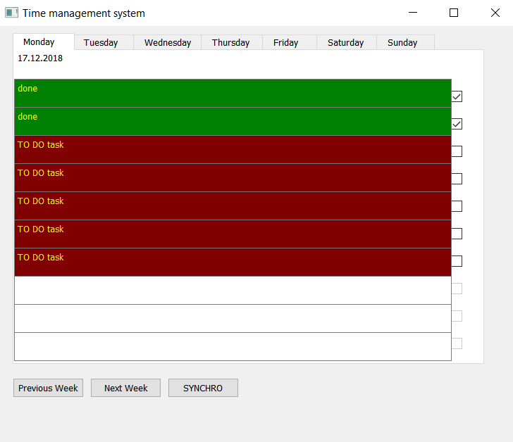

## **Time Organizer**

**Project consist of:**
- program in C++ with Qt libraries
- program in C with STM32 Standard Peripheral Libraries, made to load on STM32 F103RB board.

**Features of simple computer program interface:**
- [x] week table with data labels, facility to switch week's day
- [x] when program starts, in view is actual day
- [x] possibility to go to the previous or next week
- [x] 10 tasks may be added to each day, may be edited/deleted
- [x] initially, each task is marked as TO DO task and any time could be checked as DONE
- [x] tasks are stored in database, therefore program may be repeatedly turn off and run, and there will be no data loss

**Features of program on STM32:**
- [x] LEDs are imitating state of the tasks in day
- [ ] *todo: facility to shift days and have a view to another day tasks state (for example to check if in past days was any unaccomplished tasks)
- [ ] *todo: LCD to inspect tasks description in format [date – task number – description], buttons to switch tasks

**Example of working correctly programs:**

**COMMUNICATION SCHEME:**

Devices communicate through USART.

Data needed to be send in format [LED number – LED state]. Each LED is corresponding to task, so it is equal to format [task number – task state]. 

For example, when tasks 0, 1, 2, 3 are done and the rest of the tasks are not done yet, message send from computer to microcontroler is:
0 1 1 1 2 1 3 1 4 0 5 0 6 0 7 0 8 0 9 0

**DATABASE:**

In application I am using SQLite database management system.

Table ''tasks'' contain informations as follows:
- day,
- number,
- description,
- isToDo

Queries used on table "tasks":
- insert task,
- update task
- delete task
